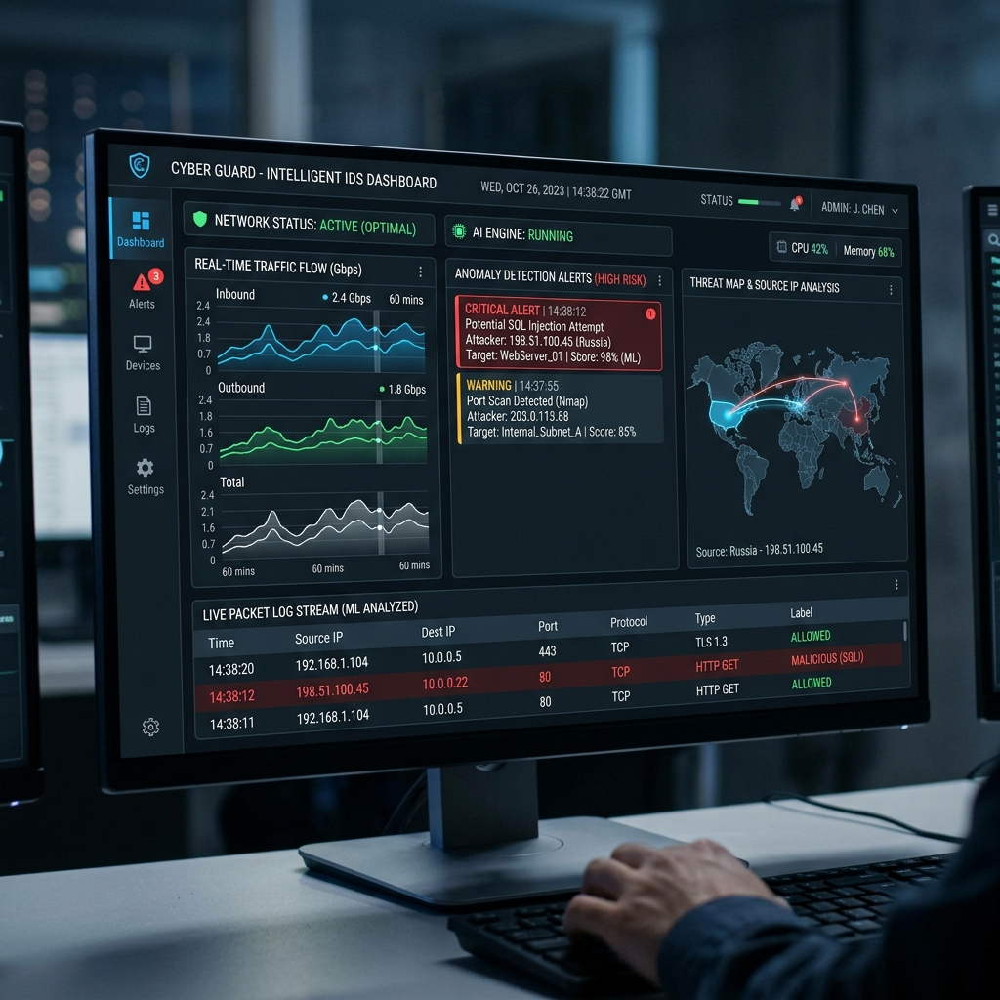
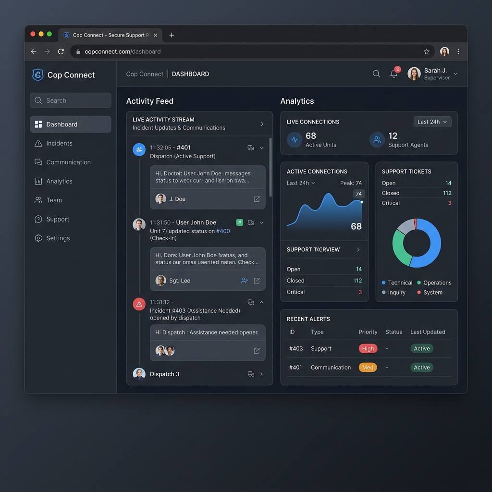
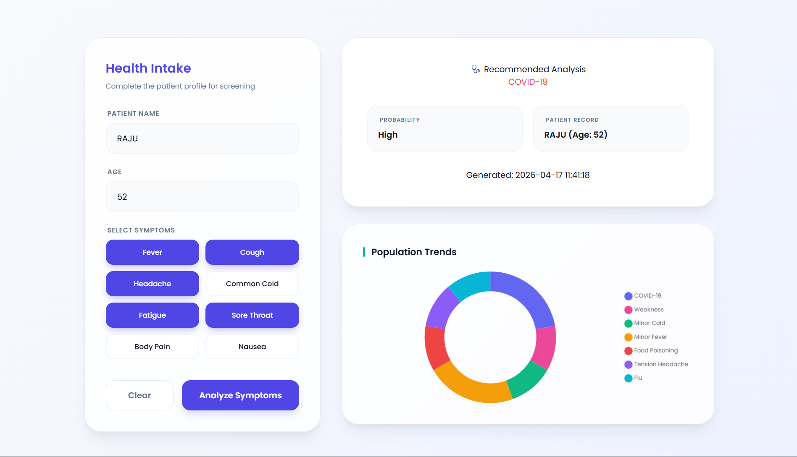

<div align="center">


# `> jayasai_pujari.init()`

### Software Engineer · AI/ML Developer · Systems Thinker

[](mailto:pujarijayasai@gmail.com)
[](https://linkedin.com/in/pujarijayasai)
[](tel:+919381453961)

</div>

---

## 📡 Overview

A high-performance, engineering-first portfolio built around a **dark terminal-inspired aesthetic** — designed to communicate technical depth, clarity, and professional credibility at a glance.

This isn't a template. It's an engineered system.

---

## ✦ Key Features

| Feature | Description |
|---|---|
| 🖥️ **Cyber-Engineering Aesthetic** | Dark mode design with terminal-green accents — high-trust, high-signal |
| ⚡ **Performance Optimized** | Lighthouse-tuned LCP, efficient asset loading, minimal render-blocking |
| 📱 **Responsive Architecture** | Seamlessly adapts across desktop, tablet, and mobile |
| 🧪 **AI/ML Project Showcases** | Deep-dive case studies: IDS, Cop Connect, Health Intake |
| 🎞️ **Interactive UI** | Smooth scrolling, intersection-based nav, staggered reveal animations |

---

## 🛠️ Technical Stack

```
┌─────────────────────────────────────────┐
│  Core        →  HTML5 · CSS3 · JS ES6+  │
│  Build Tool  →  Vite                    │
│  Assets      →  Custom SVGs & Mockups   │
└─────────────────────────────────────────┘
```

---

## 🚀 Local Development

> Prerequisites: [Node.js](https://nodejs.org/) installed on your machine.

```bash
# 1. Clone the repository
git clone https://github.com/PUJARIJAYASAI/JAYASAI_PORTFOILO.git

# 2. Navigate into the project
cd JAYASAI_PORTFOILO

# 3. Install dependencies
npm install

# 4. Start the dev server
npm run dev
```

Open your browser at `http://localhost:5173` and you're live.

---

## 🧠 Project Showcases

### 🔐 Intrusion Detection System (IDS)

An AI-powered network security system for real-time threat classification using supervised ML models. Built to handle high-throughput packet analysis with minimal false positives.

### 🚔 Cop Connect

A full-stack civic-tech platform bridging citizens and law enforcement — featuring incident reporting, real-time updates, and a geospatial case dashboard.

### 🏥 Health Intake System

An intelligent patient intake pipeline leveraging NLP to extract structured health data from unstructured form submissions, reducing manual processing overhead.

---

## 📬 Contact

```
Email    →  pujarijayasai@gmail.com
Phone    →  +91 9381453961
LinkedIn →  linkedin.com/in/pujarijayasai
```

---

<div align="center">


*Engineered for performance. Refined for impact.*

</div>